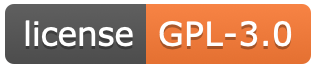

# Language model columns and various labels

Explanation of column content, and the meaning of the colour codes.

## The table columns of the resource overviews

The language models are presented as a table with 6 colums, where the leftmost column, *Documentation*, contains the language name. Here follwos an explanation of each of the six columns:

- **Documentation:** Link to the main documentation for the language resources.
- **Repository:** Link to the GitHub repository.
- **Lemma Count:** Approximate number of lemmas in the LexC code (language tables only). The badge is coloured according to the lemma criterions for maturity:
	-  **Black:**  
	    experimental level number of lemmas (<1000), or not available
	-  **Red:**  
	    alpha level number of lemmas (1000-10 000), or lemma count source not found
	-  **Yellow:**  
	    beta level number of lemmas (10 000-30 000)
	-  **Green:**  
	    production level number of lemmas (>30 000)
- **Issues:** Link to a list of open issues for the specific language. Colour codes:
	-  **Green:** no open issues
	-  **Yellow:** one or more open issues
- **Doc CI:** Continous Integration status badge for building the online documentation, including documentation generated from source code. This is the documentation linked to in the first column. When clicking the badge you get to the GitHub list of workflow runs, so that one can click further to see the actual build log files and other details. Colour codes:
	-  **Green:**  
	    last documentation build was ok, online documentation is up-to-date
	-  **Red:**  
	    last documentation build didn't go through, online documentation is outdated
- **Core CI:** Continous Integration status badge for building the core linguistic components. The exact list of components varies, and is specified in the file `.build-config.yml` at the root of each repository. By *default for new* languages morphological analysers and spelling checkers are built, while `make check` is **NOT** run during CI. **As the code is developed, one can turn on checks and more tools** as part of the CI runs, by editing that file (`.build-config.yml`). — Clicking the badge takes you to the details page for the last build, with links to log files and other details. Colour codes:
	-  **Green:**  
	    last CI build was good, no errors found during `make` or (if enabled, cf above) `make check`
	-  **Yellow:**  
	    CI running, wait until it is done
	-  **Red:**  
	    last CI build didn't go through, there's an error either in the source or in one of the tests; click the badge to get to the log view to find out more
- **Tool CI:** [Continuous Integration](https://en.wikipedia.org/wiki/Continuous_integration) status badge for the bundle and deploy status for the tools of each language, that is, whether the CI process could successfully publish the tools to relevant unstable channels. Clicking the badge takes you to the details page for the last build, with links to log files and other details. Colour codes:
	-  **Green:**  
	    last CI build was good, updated tools are available in the developer channel or on the developer CI server
	-  **Yellow:**  
	    CI running, wait until it is done
	-  **Red:**  
	    last CI build didn't go through, there was an error somewhere; click the badge to get to the log view to find out more

## Language documentation pages

When clicking on the main documentation link for each repository (the link in the first column in the tables), the page that opens contains many of the same badges as described above. In addition, there are three other badges:

-  **Maturity:**  
    The maturity of the language source code. Follows the scheme [described elsewhere](MaturityClassification.html).
-  **License:**  
    The license of the source code in the repository. The colour is automatically selected by GitHub/Shields.io, and the badge links to the license text of the repository.
-  **Glottolog:**  
    Link to the Glottolog entry for the language, or its closest relative in that space (Glottolog splits languages slightly differently from ISO 639).

