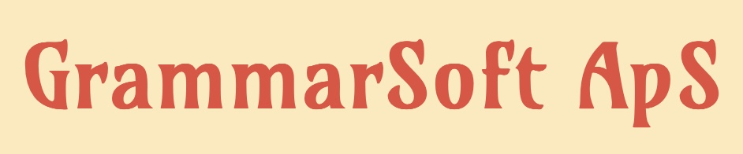

# Maintainers, Developers, Teams and Partners

## Core developers

The GiellaLT infrastructure was initially built for the Sámi languages, and even today, the teams behind Sámi language technology are the core maintainers of the infrastructure:

|                                                               |                                             |
| :-----------------------------------------------------------------------------------: | :----------------------------------------------------------------------------------------------------------------------------------------------------------------------------------------------------------------------------------- |
|   | **The Divvun group**   The Divvun group was founded in 2004 at the Norwegian Sámi Parliament, and moved to UiT in 2011. The main purpose of the group is to develop language technology tools for the Sámi language communities. |
|  | **Giellatekno**   The Giellatekno research group was founded by UiT in the early 2000's to develop and do research on Sámi language technology.                                                                                  |
|            | **UiT The Arctic University of Norway**   UiT is the world's northernmost university, and the home for both the Divvun and Giellatekno groups. It also provides GiellaLT with Enterprise GitHub services.                        |

## Sámi partners

|                                                               |                                             |
| :---------------------------------------------------------------------------------------------------------------------: | :----------------------------------------------------------------------------------------------------------------------------------- |
|                                                             | **Sámediggi**   The Norwegian Sámi Parliament founded the Divvun group in 2004, together with the Norwegian government.          |
|                                                        | **Sámi Giellagáldu**   Term development and normativity questions for all Sámi languages in the Nordic countries.                |
|  | **Ávvir**   The only daily newspaper in a Sámi language. They use the Divvun tools, and provides their texts to the Sámi corpus. |
|                  | **Giellagas-instituutti**   Cooperation covers a.o. Inari Sámi proofing tools and analysers, dictionaries, speech resources.     |
|                                                | **Aajege**   The language learning app Gïelese                                                                                   |

## Other indigenous and minority language teams and developers

Although initially built for the Sámi languages, there has from the very beginning been cooperation with other indigenous and minority language communities, starting with Greenlandic. The GiellaLT infrastructure is open to everyone, and gives a tremendeous head start for language communities wanting support for their language when writing, reading and using the language in a digital world.

|                                                               |                                             |
| :----------------------------------------------------------------------------------------------------------------------------------------------------------------------------------------------------------------------------------------------------------------------------------------------------------------------------------: | :----------------------------------------------------------------------------------------------------------------------------------------------------------------------------------------------------------------------------------------------------------------------------------------------------------------------------------------- |
|                                                                                                                                                                                                                                                                      | **AltLAB**   Language technology for Indigenous languages in Canada                                                                                                                                                                                                                                                                    |
|                                                                                                                                                                                              | **Oqaasileriffik — The Language Secretariat of Greenland**   Language technology for Greenlandic.                                                                                                                                                                                                                                      |
|  | **University of the Faroe Islands, The Centre for Language Technology**   Carries out research and development of Faroese language technology.                                                                                                                                                                                         |
|                                                                                                                                                                                                                                   | **Jack Rueter**   Skolt Sámi and Uralic languages in Russia and the Baltic countries.                                                                                                                                                                                                                                                  |
|                                                                                                                                                                                                                                                                          | **Võro Instituut**   Language technology for the Võro language in Estonia.                                                                                                                                                                                                                                                             |
|                                                                                                                                                                                                                                             | **University of Latvia Livonian Institute**   Language resources and tools for Latvia’s indigenous Livonian language.                                                                                                                                                                                                                  |
|                                                                                                                                                                                                                                                         | **Many individual contributors**   The GiellaLT infrastructure is open source, and we welcome external contributions, both directly (ask for push access) or via [Pull Recuests](https://docs.github.com/en/pull-requests/collaborating-with-pull-requests/proposing-changes-to-your-work-with-pull-requests/creating-a-pull-request). |

## Technology, maintenance and academic partners

|                                                               |                                             |
| :------------------------------------------------------------------------------------------------------------------------------------: | :------------------------------------------------------------------------------------------------------------------------------------------------------------------------------------------------------------------------------------------- |
|                                                                                 | **University of Helsinki — HFST**   Finite state transducer technology, used for morphological analysis and generation, tokenisation, spelling checkers and more.                                                                        |
|              | **University of Helsinki — phonetics lab**   Essential support for the GiellaLT speech synthesis infrastructure.                                                                                                                         |
|                                                                             | **VISL**   The home of VISLCG3, which is the tool and formalism used for all language processing after morphological analysis in the GiellaLT framework.                                                                                 |
|                                                      | **Tino Didriksen**   Windows and MS Office integration until about 2021, Greenlandic LT, and VISLCG3 development and support.                                                                                                            |
|                                                                        | **Brendan Molloy**   Morphology testing framework, mobile keyboards and keyboard generation, web speller, MacDivvun, and much more.                                                                                                      |
|                                                                      | **Necessary Innovation**   Advanced language technnology integration.                                                                                                                                                                    |
|  | **The Techno Creatives**   Support and maintenance work in the GiellaLT infrastructure and Divvun technology components 2019-2024.                                                                                                       |
|                                                               | **Apertium**   Free and open MT for many languages.                                                                                                                                                                                      |
|                                                 | **CLARIN**   GiellaLT is part of the SAFMORIL research network in CLARIN.                                                                                                                                                                |
|                                                                           | **Zulip**   An open-source modern team chat app designed to keep both live and asynchronous conversations organized. Used in the GiellaLT infra for team chat and community communication. Log in and join us using your GitHub account! |
|                                                                                 | **GitHub**   Source code repos, automatic builds, infrastructure support.                                                                                                                                                                |
|                     | **ISOF**   Language resources and tools for Meänkieli and Romani.                                                                                                                                                                |
|                                                                         | **Voikko**   Speller integration with LibreOffice until around 2022.                                                                                                                                                                     |
|                                                                                | **Trigram AS / Kevin Unhammer**   Free and open source language technology.                                                                                                                                                              |
