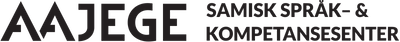

# Maintainers, Developers, Teams and Partners

# Core developers

The GiellaLT infrastructure was initially built for the Sámi languages, and even today, the teams behind Sámi language technology are the core maintainers of the infrastructure:

| Logo & link | Name & description                                                                                   |
|:-----------:|:------------------ |
|  | **The Divvun group**   The Divvun group was founded in 2004 at the Norwegian Sámi Parliament, and moved to UiT in 2011. The main purpose of the group is to develop language technology tools for the Sámi language communities.
|  | **Giellatekno**   The Giellatekno research group was founded by UiT in the early 2000's to develop and do research on Sámi language technology.
|  | **UiT The Arctic University of Norway**   UiT is the world's northernmost university, and the home for both the Divvun and Giellatekno groups.

# Sámi partners

| Logo & link | Name & description                                                                                   |
|:-----------:|:------------------ |
|  | **Sámediggi**   The Norwegian Sámi Parliament founded the Divvun group in 2004, together with the Norwegian government.
|  | **Sámi Giellagáldu**   Term development and normativity questions for all Sámi languages in the Nordic countries.
|  | **Ávvir**   The only daily newspaper in a Sámi language. They use the Divvun tools, and provides their texts to the Sámi corpus.
|  | **Giellagas-instituutti**   Cooperation covers a.o. Inari Sámi proofing tools and analysers, dictionaries, speech resources.
|  | **Aajege**   The language learning app Gïelese

# Other indigenous and minority language teams and developers

| Logo & link | Name & description                                                                                   |
|:-----------:|:------------------ |
|  | **AltLAB**   
|  | **Greenlandic language secretary**   
|  | **Faroese**   
|  | **Jack Rueter**   
|  | **Võro Instituut**   
|  | **Livonian institute**   
|  | **Many individual contributors**   The GiellaLT infrastructure is open source, and we welcome external contributions, both directly (ask for push access) or via [Pull Recuests](https://docs.github.com/en/pull-requests/collaborating-with-pull-requests/proposing-changes-to-your-work-with-pull-requests/creating-a-pull-request).

# Technology, maintenance and academic partners

- HU/HFST
- HU/phonetics lab
- VISL
- Tino Didriksen
- Brendan Molloy
- TheTechnoCreatives
- Necessary Innovation
- Apertium
- CLARIN
- Zulip
- GitHub
- Trigram AS/Kevin Unhammer
