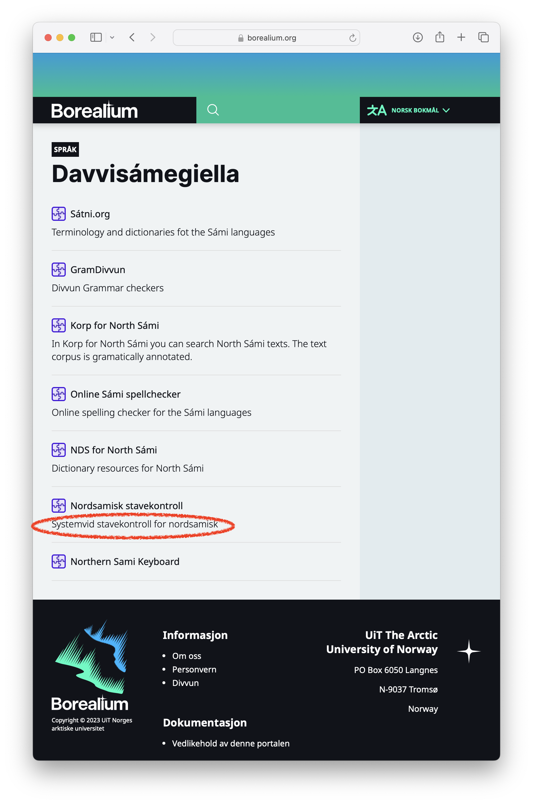
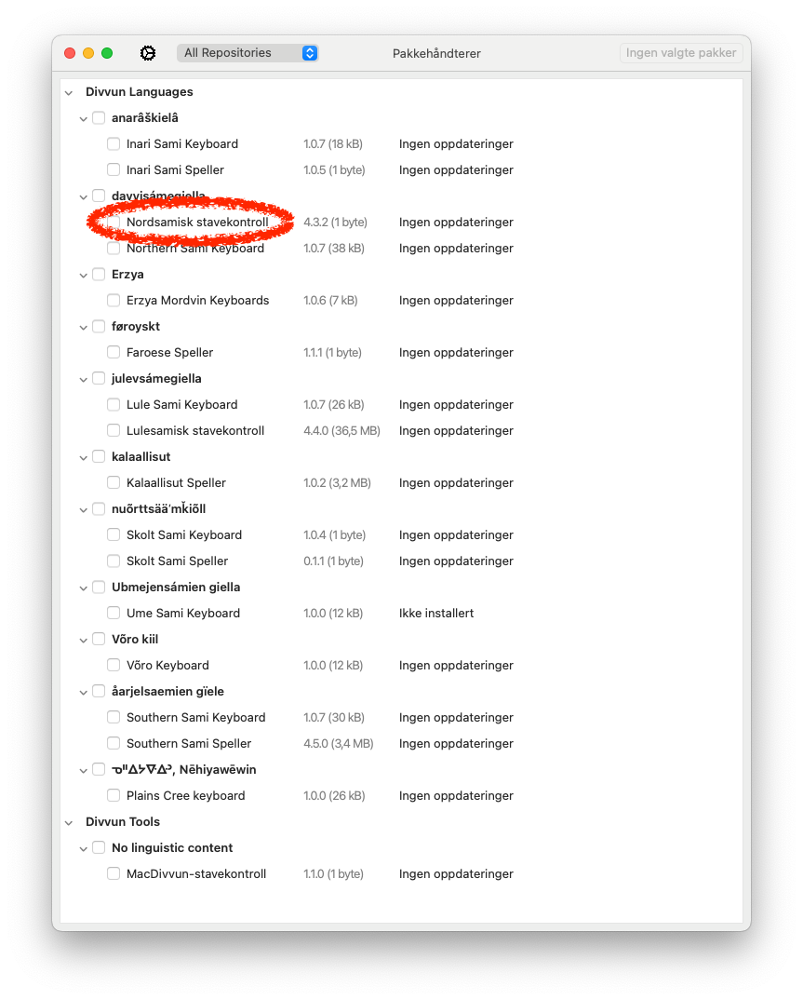
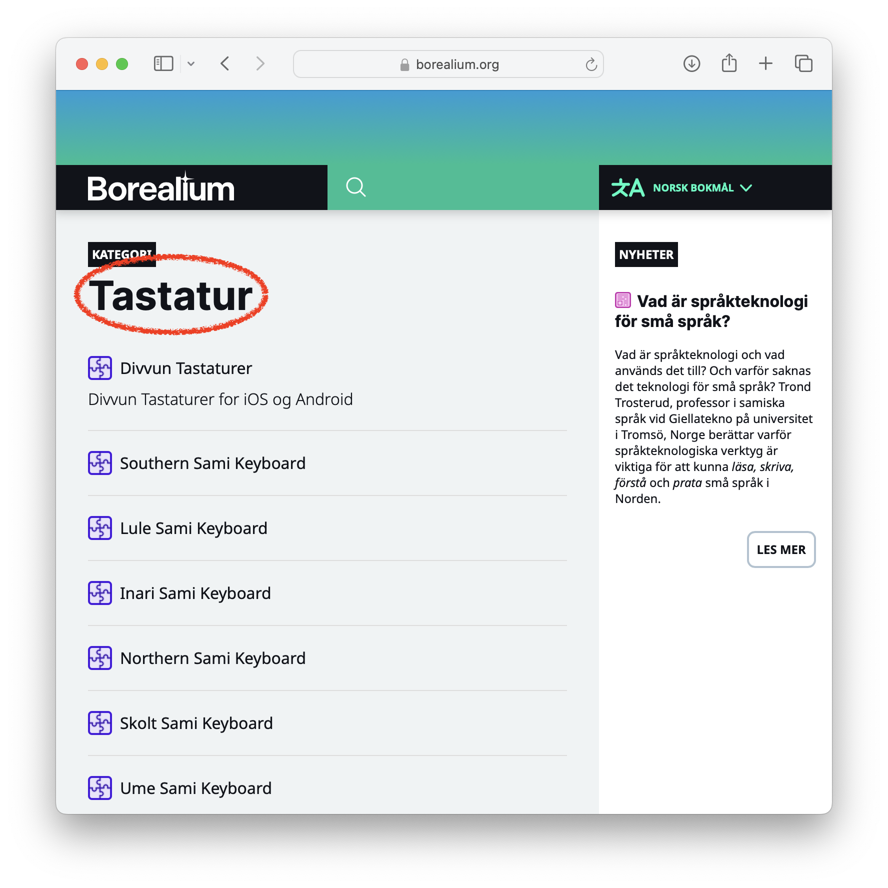
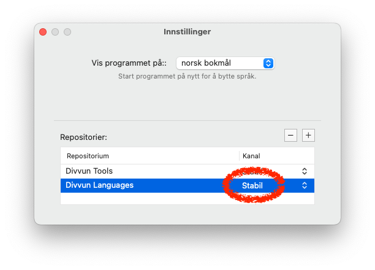
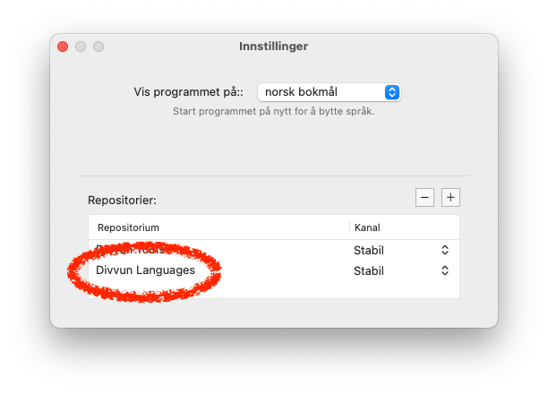
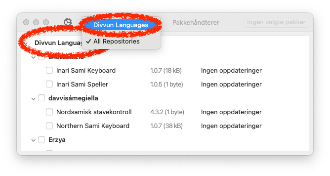

# Localising apps and webapps related to the GiellaLT infrastructure

## App overview

The following apps & webapps need localisation:

- [borealium.org](#borealiumorg)
- [Divvun Manager](#divvun-manager)
- [DM One-click installer](#dm-one-click-installer)
- [Package descriptions](#package-names-and-descriptions)
- [Páhkat categores and other strings](#páhkat)
- [satni.org](#satniorg)

Localisation of each of them is described below.

## borealium.org

[borealium.org](https://github.com/borealium/borealium.org) is almost always localised using Pontoon. Log in using your GitHub account, it should be automatic. The exact setup of the localisation is as follows:

-   **[Borealium Core](https://divvun-pontoon-vm.norwayeast.cloudapp.azure.com/projects/borealium/):** the main web site, general texts and descriptions. All UI languages should be translated 100 % for this Pontoon project
-   **Borealium Resources** (except Pahkat resources): localised names and descriptions for the language resources listed on Borealium. There is [a separate Pontoon project for each language's resources](https://divvun-pontoon-vm.norwayeast.cloudapp.azure.com/projects/), and the only localisation requirement is that every resource is localised into its own language + English, where English is the reference as well as the last-resort fallback language. Other languages may be added as desired or deemed useful, but that is not required.
    - adding new resources:
        - add basic info and links in `data/resources/` (copy one of the existing ones, then edit as needed)
        - use string identifiers instead of actual strings
        - add the string identifiers to the appriopriate localisation file in `resources/en/*-resources.ftl`, and provide suitable text in English (this becomes the reference text for localisation into other languages)
        - localise the resources as needed; the set of languages to localise into is configured in the file `resources/*-l10n.toml`, which has a very simple structure (example file taken from Faroese):

            ```toml
            [[paths]]
                reference = "en/fao-resources.ftl"
                l10n = "{locale}/fao-resources.ftl"
                locales = [
                    "fo",
                    "da",
                ]
            ```
        - Pontoon reads this config file, and in this case, Faroese resources should be localised into Faroese and Danish, using English as the reference.
        - new strings for new resources are automatically synced to Pontoon each hour (on the hour)
- **Páhkat resources:**
    -   Spellers:
        -   native language and English: `configure.ac`, in the variables `SPELLER_NAME_NATIVE`, `SPELLER_NAME_ENG`, `SPELLER_DESC_NATIVE` and `SPELLER_DESC_ENG`. The text in these variables will be used to name and describe the spellers both in Borealium.org, and in other places.
        -   Other languages: add them to `manifest.toml.in`, under the sections `[speller.name]` and `[speller.description]`, as many as is needed.
        -   When these two files are updated, make sure to run `./autogen.sh` and `./configure` once, and commit the changes made to `manifest.toml`.  After the next push to GitHub, the changes will be propagated to the Páhkat server, and from there to borealium.org on the next site build.
    -   Keyboards: edit existing `locales:` and add more to the file `XXX.kbdgen/project.yaml` (replace `XXX` with the language ISO 639-3 code):

        ```yaml
        locales:
          en:
            name: South Sami Keyboards
            description: >-
              Mobile OS keyboards for the South Sami language from the Divvun group
              at UiT.
          nb:
            name: Sørsamisk tastatur
            description: Mobiltastatur for sørsamisk fra Divvun-gruppa.
        ```
        - One can add as many `locales` as needed.
        - The new/edited locales are pushed to the Páhkat server on the next successfull CI build, and from there it is automatically picked up by borealium.org on the next site build.

**All Pontoon localisations** are automatically synced from Pontoon to GitHub, but *only* after the localisations have been *accepted*. **All Pahkat resource** localisations are automatically picked up on each site rebuild. The site is rebuilt every hour (on the hour), and on every `git push` to the repository.

Pontoon projects and user configuration is administered [here](https://divvun-pontoon-vm.norwayeast.cloudapp.azure.com/a/).

It is still possible to also do localisations directly in GitHub, and those changes will be synced with Pontoon automatically. For that reason, the documentation below is kept for reference.

---

All pathnames in this section are relative to the root of the [borealium.org](https://github.com/borealium/borealium.org) repository.

### Languages and fallback mechanisms

`data/languages.ts` contains a list of all languages covered by the site. It has four sections:

<dl>
  <dt>regions</dt>
    <dd>Defines all BCP-47 compatible area codes used in the portal, with their localised names. Regions are used to cover linguistic or orthographic variation following the regions, or just to ensure a most useful fallback list depending on region: SME in Finland should fall back to Finnish, then English, while SME in Sweden should fall back to Swedish, then English.</dd>
  <dt>languages</dt>
    <dd>The main language definition, contains language codes and the human readable names.</dd>
  <dt>fallbacks</dt>
    <dd>This is a fallback definition for page content when the requested content is not available in the desired language. This makes pages "multilingual", but in a controlled manner, so that the most appropriate language available is used to build each element of the page.</dd>
  <dt>uiOnly</dt>
    <dd>Languages that are only used to select page language in the portal, not to select tools = we do not make or promote tools for these languages (at least not in this portal).</dd>
  <dt>excludeFromUi</dt>
    <dd>Languages for which we do not have any translated content, but for which we still want them listed in the tools list. That is, skip these languages in the language selection drop down for the site, but list them in the overview of resources for languages.</dd>
</dl>

### Categories

`data/categories.ts` contains localised names and descriptions of categories.

It is seen on top of each category page. One gets to these pages when clicking on a category label.

### Resources

`data/resources/` contains the definition of all resources described on the site. Except for the file `mod.ts`, all files contain strings that should be localised. The strings are the following:

- `name` - the name of the resource
- `description` - a short description of the resource
- `moreInfo` - a longer description of the resource, if wanted
- `links:text` - text to appear on the link button. Often this can just use the English text, but sometimes a translation will work better

### Content files

Most of the content for the portal lives in `src/`. All localisable text is placed in `.flt` files, including in subdirs. At present, the following dirs contain `.flt` files to be localised:

```sh
src/
├── _components
│   └── landing
├── _includes
├── about
├── doc
│   ├── divvun-manager
│   └── website
├── post
│   └── ...
└── privacy
```

## Divvun Manager

### macOS

See [the README](https://github.com/divvun/divvun-manager-macos). But it boils down to the following:

- edit the files in `Sources/Support/LocalisationResources/`
- run:

```sh
strut-icu-generate swift Support/LocalisationResources/base.yaml \
                         Support/LocalisationResources/{your other langs}.yaml \
                   -o .
```

### Windows

See [the README](https://github.com/divvun/divvun-manager-windows). But it boils down to the following:

- edit the relevant file in `DivvunInstaller/Strings.[your_lang].resx` (add a new for new languages)
- add your new language tag in `Divvun.Installer/UI/Settings/SettingsWindow.xaml.cs`

### Both

- language names: [make PR here](https://github.com/divvun/iso639-databases)

## DM One-click installer

(Windows only)

TBW - [support and documentation missing](https://github.com/divvun/divvun-manager-windows/issues/59)

## Package names and descriptions

Packages are what we distribute to users, such as speller and keyboard packages. They are listed in various places, always with a name, and often with a corresponding description, both of which can be localised.

Below is an example of how both strings show up in [borealium.org](https://borealium.org/nb/language/se/):



and in the package listing in Divvun Manager:



Package names & descriptions are stored and localised in the following files:

- keyboards: add entries in `keyboard-XXX/XXX.kbdgen/project.yaml`
- spellers: add entries in `lang-XXX/manifest.toml.in` , **but**:
  - English and Native speller names and descriptions are stored in `lang-XXX/configure.ac`, and automatically added to `lang-XXX/manifest.toml`
  - Localisations for other languges should be added to `lang-XXX/manifest.toml.in`

As a general rule, the minimum localisation should be:

- English
- native
- other minority languages of the same country/-ies
- the majority language(s) of the country/-ies where the language of the tool is spoken

This ensures that the tool is presented in an expected language for most users.
Other localisations can of course be added ad lib.

The names and descriptions will be propagated in two steps:

1. they will be accessible on the next package update (ie after the next successfull nightly build and upload of already existing packages) - this will copy the data found in the repositories to the Páhkat index files.
2. the next time borealium.org is build or Divvun Manager loads data anew - then both will read the updated data in the Páhkat index files.

Both steps are automatic and happen regularly, so on average, new package descriptions will be available pretty soon after they have been committed and pushed.

## Páhkat

### Categories and channel labels

Category and channel labels are defined in `.toml` files in `main/strings/`. The following is the content of the `en.toml` (English) file:

```toml
[tags]
"cat:keyboard-layouts" = "Keyboards"
"cat:spellers" = "Spellers"
"cat:speller-engines" = "Speller Engines"

[channels]
"default" = "Stable"
"nightly" = "Nightly"
"beta" = "Beta"
```

The category labels are used as category headings in Borealium.org:



and the channel labels show up in the settings in Divvun Manager:



### Other strings

There are a couple of other strings as well that could or should be translated.

#### Language listing heading

This is defined in `main/index.toml`:

```toml
[name]
en = "Divvun Languages"
ru = "Языки Divvun"

[description]
en = "The repository of all languages supported by Divvun."
```

(The description is presently not being used anywhere, AFAIK.)

This text is found several places:





#### More strings

The following files and directories contain localisable strings:

- `tools/index.toml`
- `tools/strings/*.toml`

It is unclear whether these strings are displayed, if at all.

## satni.org

TBW
