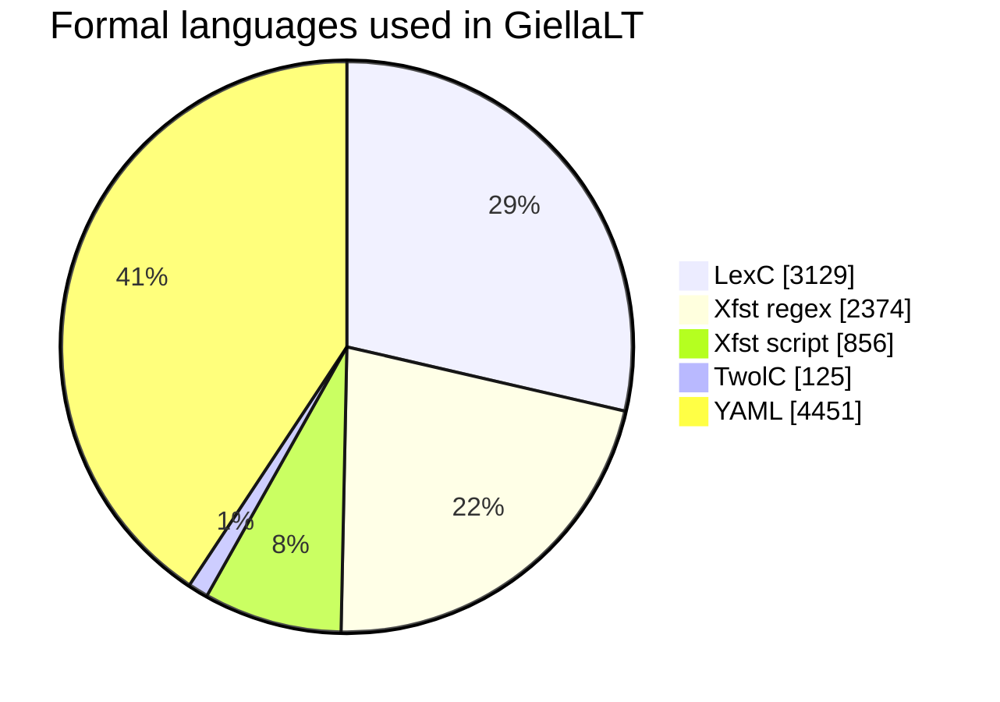
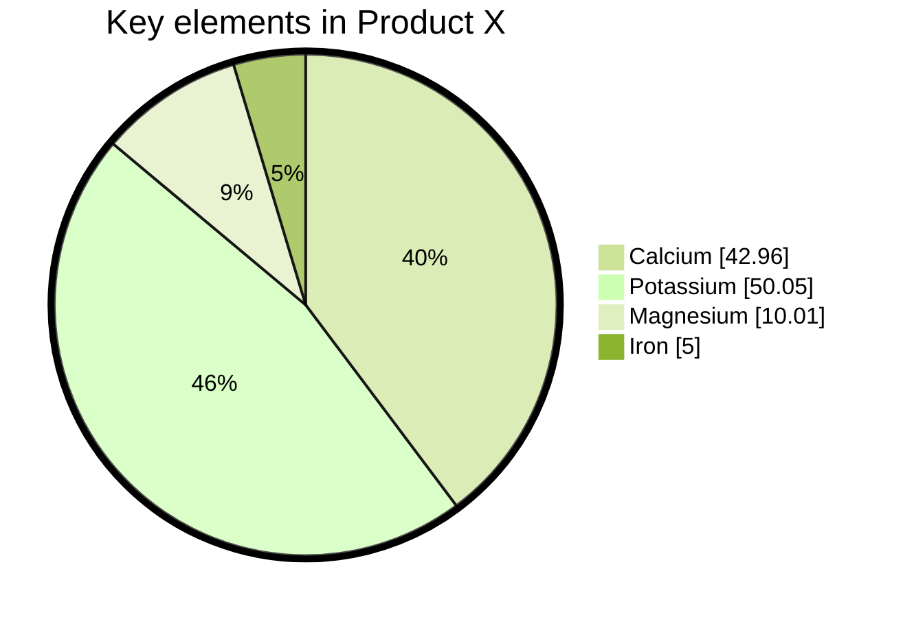
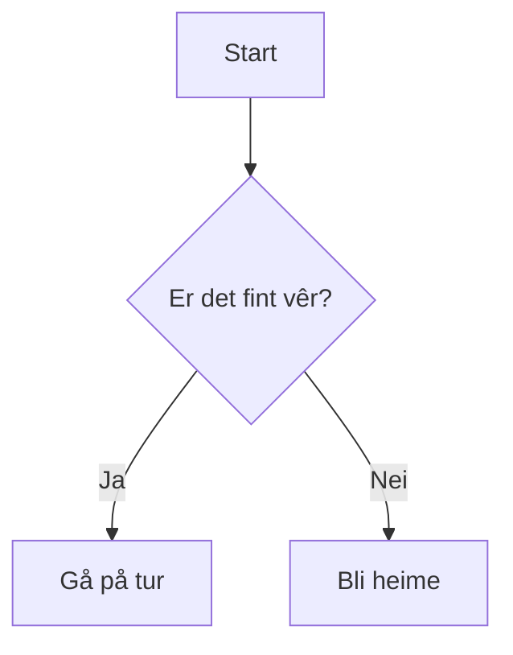
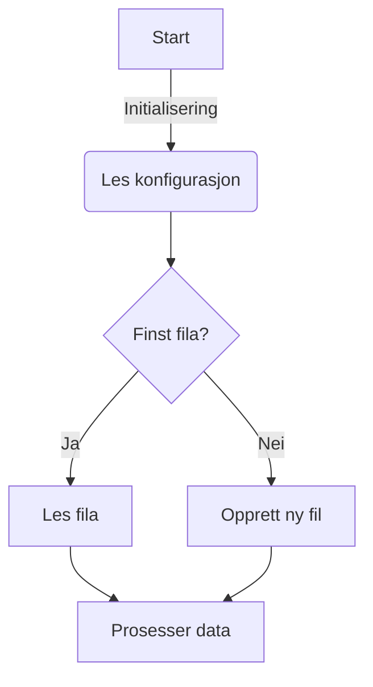

# GFM Test Document

This document contains examples of all GitHub Flavored Markdown (GFM), both code
snippets and as rendered, and additional data structures (code blocks) rendered
in various ways.

It serves both as a test on what is supported in the various places, and as a
reference for how to write GFM.

[This is how it renders](https://github.com/giellalt/giellalt.github.io/blob/main/infra/MarkdownTestReference.md)
by GitHub's own processor. There are differences compared to GitHub pages.

## Headers

Start line with 1-6 `#` characters, then a space, then the header text:

```md
# foo 1
## foo 2
### foo 3
#### foo 4
##### foo 5
###### foo 6
```

The above will be rendered as:

# foo 1
## foo 2
### foo 3
#### foo 4
##### foo 5
###### foo 6

It is also ok with `#` symbols after the header text, like this:

```md
# foo 1a           #
## foo 2a         ##
### foo 3a       ###
#### foo 4a     ####
##### foo 5a   #####
###### foo 6a ######
```

These will look like the following:

# foo 1a           #
## foo 2a         ##
### foo 3a       ###
#### foo 4a     ####
##### foo 5a   #####
###### foo 6a ######

One can also specify the two first header levels using underlines.

```md
Header text
===========
```

will show up as:

Header text
===========

and:

```md
Another header text
-------------------
```

comes out as:

Another header text
-------------------

In these cases the header text can span multiple lines, as in:

```md
Header with a
lot of text
=============
```

Header with a
lot of text
=============

```md
Second header with a
lot of text
-------------
```

Second header with a
lot of text
-------------

Please note that in the GiellaLT documentation system, only the first header on a page
can be level 1, it is used as the page title. All subsequent headers must be level 2 or more,
with level 2 being the top level header for the document content.

This also means that the generated table of content (to the left) only contains level 2
or more headers.


## Horisontal lines

One can use one of `*`, `-` or `_`. It must be at least three of them, and there
can be spaces between. There can be nothing else than whitespace and one of the
mentioned characters.

```md
---
```

renders like:

---

and:

```md
***
```

also renders like:

***

and even (at most three initial spaces)

```md
   ___
```

renders like:

   ___

Enough with horisontal lines.

## Tables

This code:

```md
| THead1 | THead2 | THead3 |
|:------ |:------:| ------:|
| Cell 1 | _Cell 2_ | **Cell 3** |
| ***Cell 4*** | Cell 5 | Cell 6 |
| Cell 7 | `Cell 8` | Cell 9 |
```

looks like this:

| THead1 | THead2 | THead3 |
|:------ |:------:| ------:|
| Cell 1 | _Cell 2_ | **Cell 3** |
| ***Cell 4*** | Cell 5 | Cell 6 |
| Cell 7 | `Cell 8` | Cell 9 |

## Emoji

[GFM emoji](https://github.com/ikatyang/emoji-cheat-sheet/blob/master/README.md) rendering has been enabled! :+1:

## HTML elements

Most elements are passed through and will render as such. The following HTML
elements **will be encoded using &lt;**, and thus be inactivated in the final html code:

- `<title>    `
- `<textarea> `
- `<style>    `
- `<xmp>      `
- `<iframe>   `
- `<noembed>  `
- `<noframes> `
- `<script>   `
- `<plaintext>`

All other html and xml tag lookalikes will be passed through, and either rendered
as usual, or be available for targeted CSS styling.

### Useful HTML elements

#### The `<ruby>` element

```xml
<ruby>tekst<rt>ja</rt></ruby>
```

will render as:

<ruby>tekst<rt>ja</rt></ruby>

This can be used to show pronunciation:

```xml
<ruby>
	<strong>cromulent</strong>
	<rp>(</rp>
	<rt>crôm-yü-lənt</rt>
	<rp>)</rp>
</ruby>
```

<ruby><strong>cromulent</strong> <rp>(</rp><rt>crôm-yü-lənt</rt><rp>)</rp></ruby>

Traditional use is for east asian scripts:

<ruby>한자<rp>(</rp><rt>漢字</rt><rp>)</rp></ruby>

Ruby elements can even be nested:

<ruby><ruby>世<rp>（</rp><rt>ㄕ ˋ</rt><rp>）</rp>上<rp>（</rp><rt>ㄕㄤ ˋ</rt><rp>）</rp>無<rp>（</rp><rt>ㄨ ˊ</rt><rp>）</rp>難<rp>（</rp><rt>ㄋㄢ ˊ</rt><rp>）</rp>事<rp>（</rp><rt>ㄕ ˋ</rt><rp>）</rp>只<rp>（</rp><rt>ㄓ ˇ</rt><rp>）</rp>怕<rp>（</rp><rt>ㄆㄚ ˋ</rt><rp>）</rp>有<rp>（</rp><rt>ㄧㄡ ˇ</rt><rp>）</rp>心<rp>（</rp><rt>ㄒㄧㄣ</rt><rp>）</rp>人<rp>（</rp><rt>ㄖㄣ ˊ</rt><rp>）</rp></ruby><rp> （</rp><rt>Anything can be done with enough perseverance</rt><rp>）</rp></ruby>

In our context it can be used for simple glossing/text annotation:

<ruby>1800-lågon<rt>1800+Num+Cmp/Hyph+Cmp#låhko+N+Sg+Ine</rt></ruby>
<ruby>hieredimbargon<rt>hieredit+V+TV+Der/NomAct+N+Cmp/SgNom+Cmp#barggo+N+Sg+Ine</rt></ruby>

```xml
<kbd>ᛌᛁᚢᚱ</kbd>
```

**<kbd>ᛌᛁᚢᚱ</kbd>**

<kbd><kbd>ᛌᛁᚢᚱ</kbd></kbd>

## Simple graphs



Based on counts of all files of the various types in all repositories in the
GiellaLT infra.

Another Mermaid test, this one includes configuration data:



And a third one:



And a fourth one:



## Mapping

### topojson

```topojson
{
  "type": "Topology",
  "transform": {
    "scale": [0.0005000500050005, 0.00010001000100010001],
    "translate": [100, 0]
  },
  "objects": {
    "example": {
      "type": "GeometryCollection",
      "geometries": [
        {
          "type": "Point",
          "properties": {"prop0": "value0"},
          "coordinates": [4000, 5000]
        },
        {
          "type": "LineString",
          "properties": {"prop0": "value0", "prop1": 0},
          "arcs": [0]
        },
        {
          "type": "Polygon",
          "properties": {"prop0": "value0",
            "prop1": {"this": "that"}
          },
          "arcs": [[1]]
        }
      ]
    }
  },
  "arcs": [[[4000, 0], [1999, 9999], [2000, -9999], [2000, 9999]],[[0, 0], [0, 9999], [2000, 0], [0, -9999], [-2000, 0]]]
}
```

### geojson

```geojson
{
  "type": "Polygon",
  "coordinates": [
      [
          [-90,30],
          [-90,35],
          [-90,35],
          [-85,35],
          [-85,30]
      ]
  ]
}
```

### Some map examples

Oslo centre:

```geojson
{
  "type": "Feature",
  "properties": {
    "name": "Stor-Oslo",
    "description": "Circle radius: 5km",
    "marker-color": "#ff4444",
    "marker-size": "medium"
  },
  "geometry": {
    "type": "Point",
    "coordinates": [10.7522, 59.9139]
  }
}
```

Bergen and Trondheim:

```geojson
{
  "type": "FeatureCollection",
  "features": [
    {
      "type": "Feature",
      "properties": {
        "name": "Bergen sentrum",
        "description": "Circle radius: 10km",
        "marker-color": "#00aaff",
        "marker-size": "medium"
      },
      "geometry": {
        "type": "Point",
        "coordinates": [5.3221, 60.3913]
      }
    },
    {
      "type": "Feature", 
      "properties": {
        "name": "Trondheim",
        "description": "Circle radius: 15km",
        "marker-color": "#22cc22",
        "marker-size": "medium"
      },
      "geometry": {
        "type": "Point",
        "coordinates": [10.3951, 63.4305]
      }
    }
  ]
}
```

South Sámi:

```geojson
{
  "type": "Feature",
  "properties": {
    "name": "South Sámi",
  },
  "geometry": {
    "type": "Point",
    "coordinates": [13.15, 63.88]
  }
}
```
