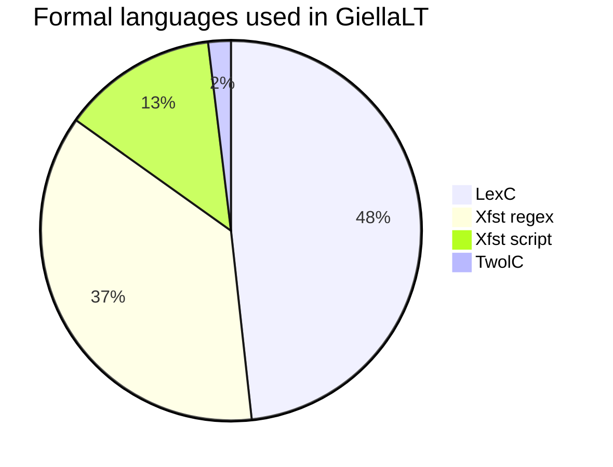

# Documentation infrastructure

## Core components

The documentation infrastructure is built on the following stones:

- [GirHub Flavoured Markdown (GFM)](https://enterprise.github.com/downloads/en/markdown-cheatsheet.pdf)
- [GitHub Pages](https://pages.github.com)
- the GH Pages theme [jekyll-theme-minimal](https://github.com/pages-themes/minimal), with additions and modifications:
	- left side TOC (see next point)
	- right side sitemap
	- grid-based layout
	- responsive design
- Table of contents (TOC) created using [jekyll-toc](https://github.com/allejo/jekyll-toc)
- Markdown linting rules:
    - only one H1 header (page title)
    - H2 headers are the first header level listed in the TOC
- every documentation subfolder must have an `index.md` file for the content in that folder to be listed the sitemap (AKA the right side menu). No index file ⇒ no sitemap listing for that folder.

All `keyboard-xxx` and `lang-xxx` repositories (except private ones) have their
own online site as subsites of [giellalt.github.io](https://giellalt.github.io).
There are separate pages for [keyboards](/KeyboardLayouts.html) and
[language models](/LanguageModels.html) with links directly to all subsite repos.

To update the online documentation, just save Markdown files in the `docs/`
folder of the repository, commit and push,
and the updated documentation will be online within a minute.

## In-source documentation in `lang-XXX` repositories

All source code in the `lang-XXX` repositories containing
[documentation markup](infraremake/In-sourceDocumentationSpecification.md) will
be automatically parsed and the documentation extracted. The extracted
documentation will be automatically added to the site on the next `svn commit`/`git push`.

Source file types being scanned for documentation comments are:

- lexc
- twolc
- cg3
- pmscript
- xfscript

The top directories `src/` and `tools/`, including all subdirs, are scanned.
_Generated_ files of the above types are _not_ scanned.

## Additional features

Beyond what is included in GFM, the GiellaLT documentation infrastructure also
supports Mermaid, emojis and maps using GeoJSON or TopoJSON code fragments, just as GitHub does in their Markdown rendering.

### Mermaid test

Based on counts of all files of the various types in all repositories in the
GiellaLT infra.

### Dark mode

The site supports dark mode, see the bottom of the page (left side in large browser windows)
for colour theme switch buttons.

### Slidev support

There is built-in support for [**Sli**dev](https://sli.dev) presentations. See
[Slidev-presentations](Slidev-presentations.md) for more details.

Basic purpose:
- simple slides from Markdown documents
- present core parts of the infra as slide shows

Nothing written as slides yet, but the supporting infra is there.
