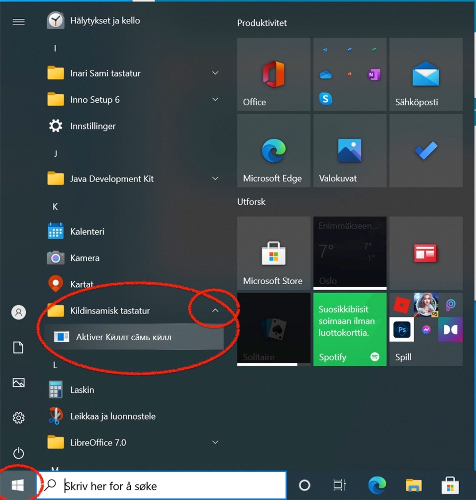
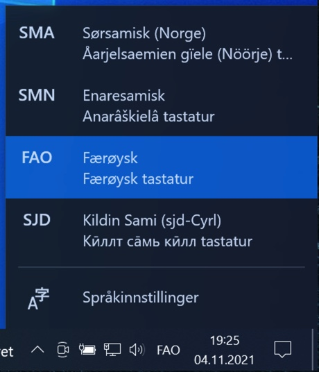

# Installing keyboards

This page documents tweaks aod problems with installing and using keyboards installed via the _Divvun Manager_.

# Installing on Windows

You find the Divvun Manger (DM) at [divvun.no/](https://divvun.no/). Follow the instructions (note that you need administrator access on Windows to do so).

If you install a language not on the frontpage of DM (which is Faroese and some Sámi languages), you should under **Settings** (hamburger menu) change **Channel** from **Stable** to **Nightly** under settings and then back in the main window exchange **Divvun languages** with **All Repositories**.

Then scroll through the list of languages and find your language (note, different alphabets are sorted separately). Tick off the keyboard (and speller) you want, and press the **Install** button (upper right in the window).

Thereafter DM tells you have installed the keyboard. Now you must **activate** it.

**Note:** Divvun Manager keyboards should **not** be activated from the same location as the standard Windows keyboards (the standard approach is via the keyboard menu in the lower right corner or via system settings).

With Divvun keybards, instead do the following: After having installed the keyboard in Divvun manager, locate the keyboard folder in the Start Menu, open it and click on `Activate`.

**Note on Windows 11:** In Windows 11, the Start menu is somewhat hidden.
Cf. the following picture (here in Norwegian, hence _Aktiver_, followed by the name of the language you install a keyboard for:

After you have clicked the "Activate" (in the picture: "Aktiver") link, the new keyboard (in the picture below: SJD) will pop up in the keyboard menu in the lower right corner. You may have to restart the computer.

# One-click installation on Windows

The following procedure **is not tested**, and is put here for internal development only. Click on the link below, and you are on your own.

[One-click installation](https://pahkat.uit.no/divvun-installer/download/divvun-installer-oneclick?platform=windows)
