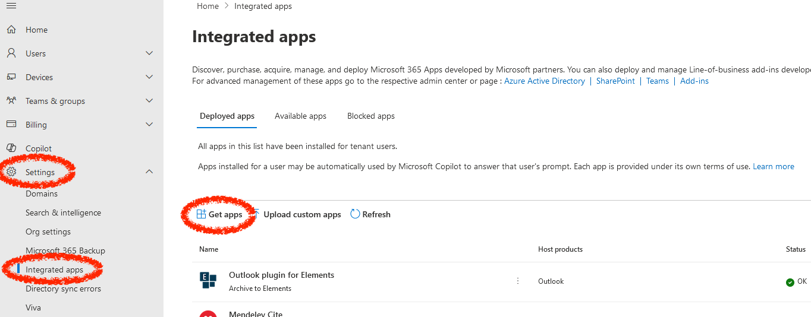
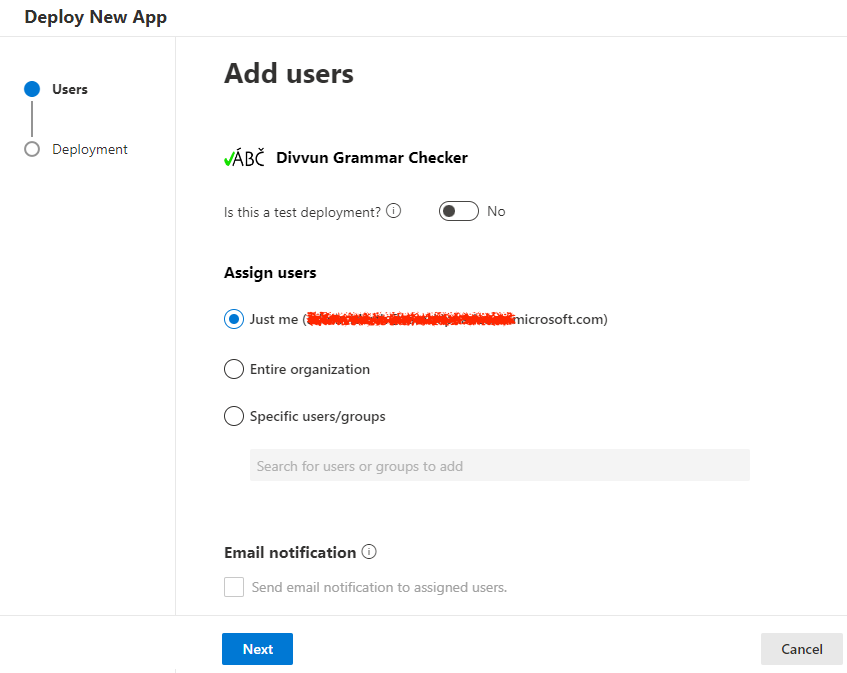

# Enabling the Divvun Grammar Checker Office add-in

Many organisations block access to the Office Add-in Store, for security reasons. This automatically also blocks access to the Divvun Grammar Checker Add-in.

To enable this or other specific add-ons for your organisation, follow these instructions.

1. go to [admin.microsoft.com](https://admin.microsoft.com/) and log in with your organisation's admin account
1. Click on **Settings > Integrated apps**: \\
  
1. Click on **Get apps**
1. In the view that opens, search for **Divvun** in the search field: \\
  
1. Click on **Get it now**
1. Choose whome to give access to the Office Add-in (you can change this later). \\
   \\
    - The *Is this a test deployment* option is only used for filtering purposes in the Office Admin app, it has no effect beyond this.
    - It is often useful to enable it for only a small group of testers first, and then open up for a larger group or the whole organisation after testing
    - the groups have to be one of the following types:
        - Mail-Enabled Security
        - Distribution List
        - Microsoft 365
1. Click **Next > Next > Finnish deployment**
1. The app/Office Add-in will show up in the list of Administered Add-ons after a while.

Microsoft has a more thorough description [here](https://learn.microsoft.com/en-us/microsoft-365/admin/manage/test-and-deploy-microsoft-365-apps?view=o365-worldwide) and [here](https://learn.microsoft.com/en-us/microsoft-365/admin/manage/office-addins?view=o365-worldwide).

When the Divvun grammar checker Office Add-in is available, users can install it by following [these instructions](https://divvun.no/en/korrektur/gramcheck.html).
